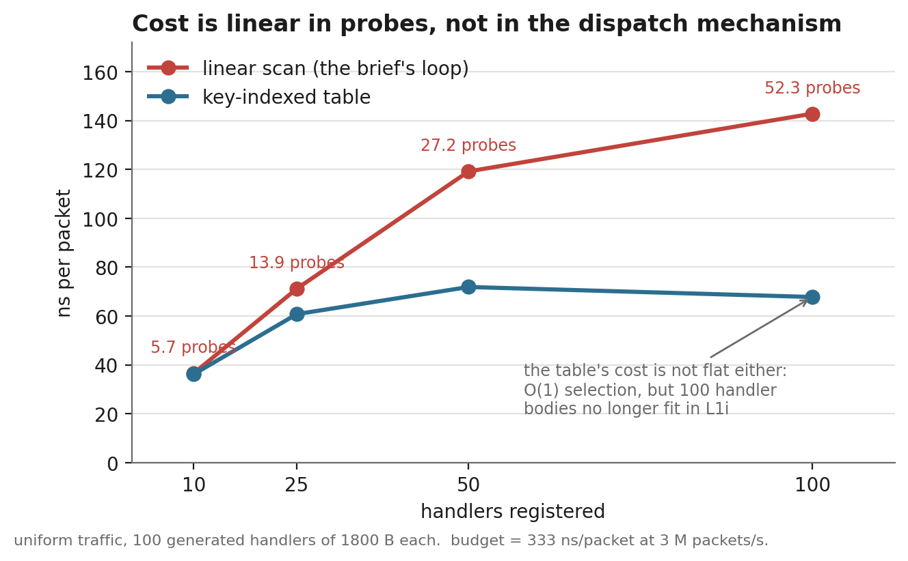
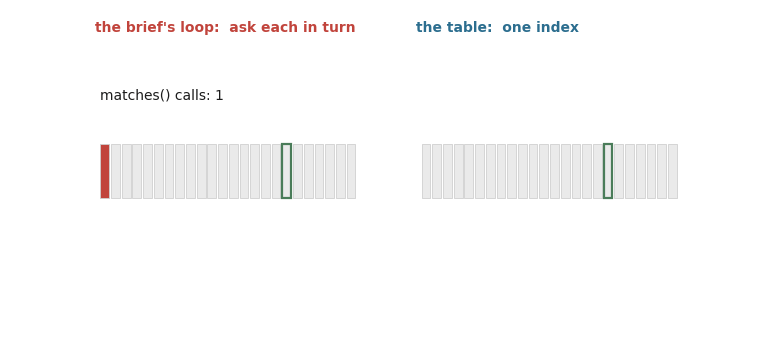
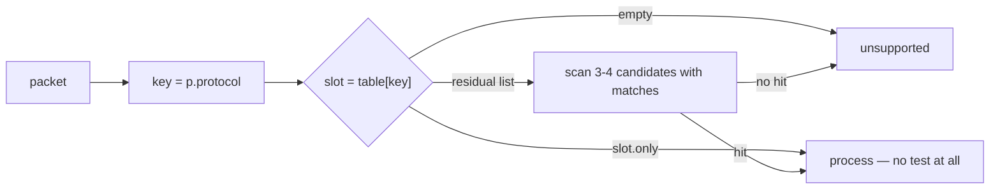
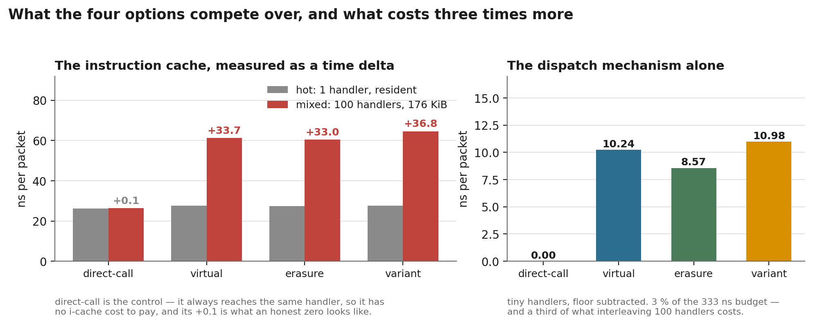
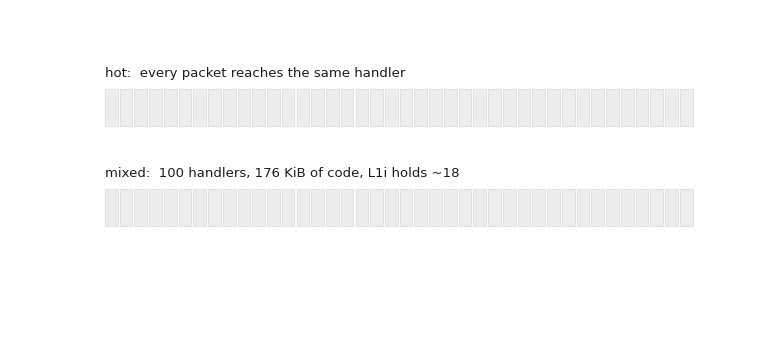
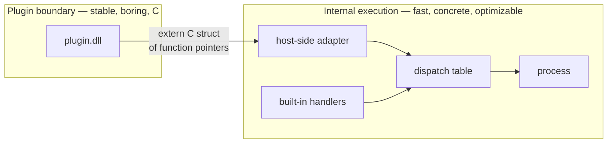
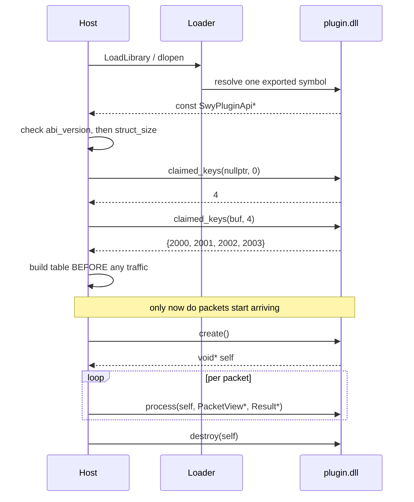
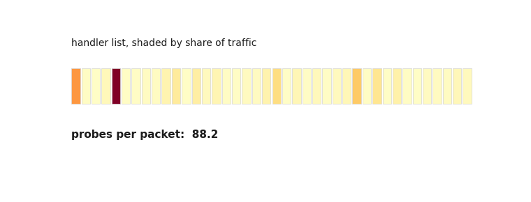
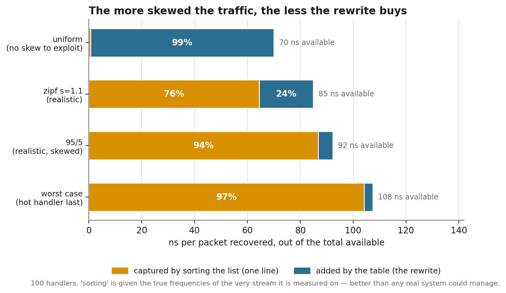
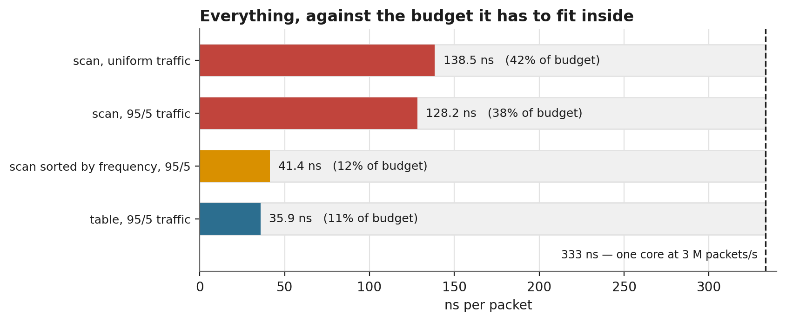

# Your profiler said `dispatch`. It did not say `virtual`.

*A packet-processing service, 100 protocol handlers, a plugin ABI, and what happens when you measure
the thing the question told you not to look at.*

This is a guided walkthrough of [the C++ answer](../cpp/solution.md) to
[the plugin-dispatch kata](../question.md). The solution document is written as an *answer* — dense
and argued, assuming you already worked the problem. **This one is written to be learned from.** It
derives the numbers instead of quoting them, stops to explain the background it depends on, and asks
you to predict results before showing them.

Every number comes from running [`cpp/bin/solution.exe`](../cpp/bench/), and every figure is
generated by [`figures/make_figures.py`](figures/make_figures.py) from those same numbers, so the
prose and the pictures cannot drift apart.

**How to read this.** Wherever you see a *Predict* box, actually stop and answer it. The post is
built around a sequence of results that are not what most people guess, and the value is in noticing
the gap between your guess and the measurement. Three of my own predictions turned out wrong, and
they are all still in here with the evidence that changed my mind.

**What you need to know already:** C++ basics and roughly what a virtual function is. Everything
else — vtables, instruction cache, ABIs, `dlopen`, identical-code folding — is explained where it
first matters.

---

## Contents

| | |
|---|---|
| [1](#1-the-question-and-the-trap-inside-it) | The question, and the trap inside it |
| [2](#2-first-work-out-what-you-can-afford) | First, work out what you can afford |
| [3](#3-cost-the-loop-before-you-cost-the-call) | Cost the loop before you cost the call |
| [4](#4-stop-searching) | Stop searching — and what a table costs you |
| [5](#5-only-now-the-mechanism) | Only now, the mechanism |
| [6](#6-the-thing-that-costs-three-times-more-than-the-mechanism) | The thing that costs 3× more |
| [7](#7-two-planes) | Two planes |
| [8](#8-the-abi-in-bytes) | The ABI, in bytes |
| [9](#9-four-silent-failures-the-c-boundary-removes) | Four silent failures the C boundary removes |
| [10](#10-does-any-of-it-actually-pay) | Does any of it actually pay? |
| [11](#11-how-to-benchmark-something-this-small) | How to benchmark something this small |
| [12](#12-when-to-do-none-of-this) | When to do none of this |
| [13](#13-what-to-take-away) | What to take away |

---

## 1. The question, and the trap inside it

You are designing a C++20 packet-processing service. Packets arrive; each belongs to some protocol;
a *handler* knows how to process one protocol. New protocols get added over time, and some handlers
ship as plugins rather than being compiled into the service.

Here is the code, and it is the most natural thing anyone would write:

```cpp
struct Handler {
    virtual ~Handler() = default;
    virtual bool   matches(const Packet&) const = 0;   // "is this mine?"
    virtual Result process(const Packet&)       = 0;   // "then here's the answer"
};

std::vector<std::unique_ptr<Handler>> handlers;

Result dispatch(const Packet& p) {
    for (auto& h : handlers) {
        if (h->matches(p))
            return h->process(p);
    }
    return Result::unsupported();
}
```

A concrete pair of handlers, so the shape is clear:

```cpp
struct TcpHandler : Handler {
    bool matches(const Packet& p) const override { return p.protocol == 6; }
    Result process(const Packet& p) override { /* ... */ }
};

struct UdpHandler : Handler {
    bool matches(const Packet& p) const override { return p.protocol == 17; }
    Result process(const Packet& p) override { /* ... */ }
};
```

The brief adds three facts:

- There may be **50–100 handlers**.
- Some are built in; **others come from separately compiled shared libraries**.
- Profiling shows **`dispatch` is becoming expensive** at several million packets/sec.

And the team proposes four alternatives:

1. Keep virtual interfaces
2. `std::variant` + `std::visit`
3. Templates / static polymorphism
4. Custom type erasure

> **Predict.** Before reading on: which would you pick, and what would you expect the speedup to be?
> Write it down. Most people pick 2 or 4 and expect something like 2×.

### The trap

Read the option list one more time, and ask what all four have in common.

Every one of them changes **how `process` is called**. Not one of them changes **how many times
`matches` is called**.

Now look at what the profiler actually said: *`dispatch` is expensive.* That is a statement about a
**function**. The option list is a proposal about a **line inside it** — specifically, the
`h->process(p)` line. Between those two statements sits an assumption nobody tested.

```text
  what the profiler measured        what the option list assumes
  --------------------------        ----------------------------
  dispatch()  ......... hot         the virtual call in it is slow
     |
     +-- for (auto& h : handlers)   <-- nobody looked here
     +-- h->matches(p)              <-- or here
     +-- h->process(p)              <-- all four options fix THIS
```

This matters far beyond this kata. A sampling profiler attributes samples to functions. Getting from
"this function is hot" to "this *operation* is slow" is a separate inference, and it is where an
enormous amount of optimization effort is wasted.

Everything below is what happens when you check.

---

## 2. First, work out what you can afford

Never optimize without a budget. Otherwise you cannot tell a real win from a rounding error.

The brief says "several million packets per second". Take three million, on one core:

```text
  1 second / 3,000,000 packets  =  333 nanoseconds per packet
```

That 333 ns has to cover *everything*: parsing, selecting the handler, the handler's own work, and
producing a result. On a ~3 GHz core that is roughly a thousand cycles.

A thousand cycles sounds generous. Here is what it actually buys, so you can calibrate:

| operation | typical cost | how many fit in 333 ns |
|---|---|---|
| L1 cache hit | ~1 ns | 300 |
| correctly predicted branch | ~0.3 ns | 1000 |
| **mispredicted** branch | ~5 ns | 65 |
| L2 hit | ~4 ns | 80 |
| L3 hit | ~20 ns | 16 |
| **DRAM access** | ~80 ns | 4 |

*(Orders of magnitude for a modern x86 core, not measured here — they are for calibration only. Every
other number in this post is measured.)*

Look at the mispredicted-branch row and hold onto it. **Sixty-five mispredictions consume the entire
budget.** The brief says there are 50–100 handlers, and the loop makes a data-dependent branch
decision per handler. That should already be making you uneasy about the loop rather than the call.

From here on, every cost is reported against 333 ns, because **a number you cannot compare to a
budget is trivia, not a measurement.**

---

## 3. Cost the loop before you cost the call

### First, predict it

Before running anything, you can work out what the loop should cost. This is worth doing by hand,
because if the measurement disagrees with a careful estimate, one of them is wrong and you want to
know which.

Setup: 100 handlers, traffic spread uniformly across them, and about 2 % of packets match no handler
at all (a real service always has some).

**How many `matches()` calls per packet?**

```text
  matched packet:    handler is equally likely to be at any position 1..100
                     average probes = (1 + 100) / 2 = 50.5

  unmatched packet:  every handler is asked, and all say no
                     probes = 100

  weighted:          0.98 x 50.5  +  0.02 x 100
                   =    49.5      +    2.0
                   =   51.5 probes per packet
```

> **Predict.** The measured value is 52.3. Where does the extra 0.8 come from?

<details>
<summary>Answer</summary>

From the handlers whose predicate is *not* just a key comparison. In the benchmark, 10 % of handlers
also test a payload byte, and they share three protocol keys among them. A packet carrying one of
those keys has to walk past the handlers whose extra condition fails before reaching the one that
matches, and every one of them is eighth in its ten: key 901's four sit at positions 8, 38, 68 and
98, averaging 53 rather than 50.5. Keys 900 and 902 have only three handlers for four payload values,
so one packet in four carrying them matches nobody and walks all 100.

Redo the arithmetic with that split, enumerating every handler and payload value, and you get 52.2
against a measured 52.3. That is close enough to say you understand the system.

</details>

### Now measure it



At 100 handlers the loop runs **52.3 `matches()` calls** per packet, and the whole arm costs
**142.8 ns** — **43 % of the entire budget**. The table arm runs the very same handler bodies for
67.8 ns, so **about 75 ns** of that is spent finding the handler before it does one byte of useful
work.

Here is what those probes look like, next to the alternative:



### Read the shape, not just the endpoint

Two things in that chart are worth more than the headline number.

**The red line tracks probes, not handlers-as-such.** Double the probes, roughly double the cost.
That is the signature of a search, and no change to *how `process` is called* can touch it.

**The blue line is not flat.** The table's selection is O(1) — one array index, regardless of handler
count — yet it still climbs from 36.2 ns to 67.8 ns as handlers go 10 → 100.

> **Predict.** Why would an O(1) lookup get slower as you add handlers it never looks at?

<details>
<summary>Answer</summary>

Because *selection* is O(1) but the *code being selected* is not free to have around. 100 handler
bodies are 176 KiB of machine code, and the CPU's instruction cache holds 32 KiB. The lookup did not
get slower; fetching the handler's code did.

This is §6, and it turns out to cost more than the entire polymorphism debate.

</details>

### The arithmetic that decides the kata

```text
  cost of finding the handler at 100 handlers   ~ 142.8 - 67.8  =  75 ns
  cost of the dispatch mechanism (measured §5)                  =  10 ns
```

You are being invited to argue about the 10 while the 75 sits untouched. That is the whole trap, and
you can see it before writing a line of the replacement.

**Transferable lesson:** when a profiler blames a function that contains a loop, cost the loop first.
"How expensive is this operation" and "how many times do we do it" are different questions, and the
second one is usually where the order of magnitude lives.

---

## 4. Stop searching

A linear search is made fast by *not performing one*. The packet already carries a protocol number;
use it as an index.

```cpp
// The idea, in its simplest form.
std::array<Handler*, 65536> table;      // indexed by p.protocol
Handler* h = table[p.protocol];
return h ? h->process(p) : Result::unsupported();
```

That much is obvious and most people get there quickly. **The two things that are not obvious are
what it costs you** — and neither cost is measured in nanoseconds.

### Problem 1: not every predicate has a key

`matches()` is arbitrary code. Nothing in the brief says it only compares a protocol number, and in a
real system it often does not:

```cpp
// Fine — a pure function of the key. Can own a table slot.
bool matches(const Packet& p) const override { return p.protocol == 6; }

// NOT a function of the key. No table can select on this.
bool matches(const Packet& p) const override {
    return p.protocol == 6 && p.payload[0] >= 0x40 && p.payload[0] < 0xC0;
}

// Worse — depends on state from earlier packets.
bool matches(const Packet& p) const override {
    return p.protocol == 6 && session_table_.has_active(p.flow_id());
}
```

Call the extra clause a **residual predicate**: the part of `matches()` left over after you factor
out the key. A handler with one cannot own a slot outright, because owning a slot means "if the key
matches, you run" — and that is not true of it.

So the design is not "table instead of loop". It is **table, then a very short loop**:



Each slot is one of two shapes:

```cpp
struct Slot {
    uint16_t      key;     // the protocol that claimed this slot, verified on lookup
    Handler*      only;    // fast path: this handler's predicate IS "key matches",
                           //   so once the key selected it, no test is needed at all
    uint32_t      begin;   // slow path: a range into a flat array of candidates,
    uint16_t      count;   //   which must still be scanned with matches()
};
```

And the lookup, in full — this is the real code:

```cpp
const Slot& s = tbl_[p.protocol & kMask];
if (s.key != p.protocol) return Result::unsupported();   // key not claimed
if (s.only) return s.only->process(p);                   // fast path: no matches() at all
for (uint16_t i = 0; i < s.count; ++i) {                 // slow path: short scan
    Handler* h = cand_[s.begin + i];
    if (h->matches(p)) return h->process(p);
}
return Result::unsupported();
```

Notice what the fast path does **not** do: it never calls `matches()`. That is where the win comes
from. The key already proved the handler is the right one, so the test is redundant — and deleting
redundant work is a much better trick than making the work faster.

The residual list is where the complexity you removed goes to live. **Bounding it is a design
constraint the brief never mentions and you have to invent.** If most of your handlers end up in
residual lists, you have rebuilt the loop inside the table and paid for a schema on the way.

> In the benchmark, 10 % of handlers are given a residual predicate *and made to share keys*, so
> those lists are genuinely 3–4 entries long. That is deliberate: a version where every list had one
> entry would have made the table look better than it deserves.

### Problem 2: first-match-wins is a behaviour, and a table has no order

The brief's loop returns the **first** match. If two handlers' predicates overlap, the list's order
decides which one runs — which means the order is *observable behaviour*, and somebody may be relying
on it.

The benchmark asserts this rather than describing it:

```text
  overlapping predicates: registration order -> handler 1, reversed -> handler 2
```

Same two handlers, same packet, different answer — because the list was in a different order.

> **Why this matters more than it looks:** §10's cheapest competitor to the entire rewrite is
> *sorting the handler list*. If any two predicates overlap, that one-line "optimization" silently
> changes what your service does. Hold that thought.

### Problem 3: the table you index directly is a megabyte

The protocol field is 16 bits, so the naive table has 65536 slots whether you use them or not:

```text
  direct16   [ 65536 slots x 16 B ]  = 1024 KiB, of which 100 slots are used
  compact    [  1024 slots x 24 B ]  =   24 KiB, key stored and verified in the slot
```

Measured speed difference: **inside the noise** (66.8 vs 68.5 ns), because the handful of hot slots
stay cached either way.

So does it matter? Yes — and the benchmark cannot show you why. A megabyte of L2 and L3 spent on
mostly-empty pointers is a cost paid by *every other part of the process*, and a benchmark that
measures only this loop will never see it. This is a general hazard: **a microbenchmark cannot
measure the cost your code imposes on its neighbours.**

The compact table stores the key in the slot and verifies it, which costs one comparison and turns a
1 MiB array into 24 KiB. Take that trade.

> **Try it yourself.** Why not `std::unordered_map<uint16_t, Handler*>`?
>
> <details><summary>Answer</summary>
>
> A hash map costs you a hash, a modulo, a bucket load, and a pointer chase into a node — and gives
> back the ability to have a sparse, arbitrary key space you did not need, since the key is already a
> small integer. `p.protocol & kMask` is one AND. Reach for a hash map when the key is a string or
> genuinely sparse; here the key was designed to be an index.
> </details>

---

## 5. Only now, the mechanism

Selection is O(1). One call per packet remains. **Now** the brief's question can be asked, and asked
against the right number.

### What a virtual call actually does

Worth being concrete, since the whole debate is about these few instructions:

```text
  h->process(p)   with h a Handler*

  1. load the object's vtable pointer     mov  rax, [rdi]        <- depends on h
  2. load process's slot from the vtable  mov  rax, [rax + 16]   <- depends on step 1
  3. indirect call                        call rax               <- depends on step 2
```

Three steps, each depending on the previous one — a *dependency chain* the CPU cannot overlap. Plus
the indirect call is a branch whose target the predictor must guess; with 100 possible targets it
often guesses wrong, and §2's table says a mispredict is ~5 ns.

Type erasure removes step 1 by storing the function pointer *next to* the object pointer:

```cpp
struct Erased {
    void*  obj;                              // the handler's state
    Result (*fn)(void*, const Packet&);      // the handler's code
};
// dispatch: const Erased& e = table[i]; return e.fn(e.obj, p);
```

```text
  virtual   table[i] -> Handler*  ->  vtable*  ->  fn      (two dependent loads)
  erasure   table[i] -> { obj, fn }            ->  fn      (one)
```

> **Predict.** How much is that one saved load worth, per packet?

### The measurement

All four arms below perform the **identical** selection — one masked array index — and differ only in
how they reach `process()`. Selection is common-mode and cancels out, which is the only way a
comparison of dispatch mechanisms means anything.



The right-hand panel answers the question as asked:

| mechanism | cost | share of the 333 ns budget |
|---|---|---|
| erasure | 8.57 ns | 2.6 % |
| virtual | 10.24 ns | 3.1 % |
| variant | 10.98 ns | 3.3 % |

**The entire debate is worth 1.7 ns**, and the whole mechanism is worth about 3 % of a packet. Type
erasure does win, and the reason is exactly the saved dependent load — but if you cannot name the
cost you removed, you are cargo-culting.

Compare that against §3: the search was 75 ns. **You were invited to optimize the 10 and ignore the
75.**

### `std::variant` is disqualified by a sentence, not a benchmark

This is the part worth internalizing, because it is a *kind* of reasoning rather than a fact.

Go back to the brief: *"others come from separately compiled shared libraries."*

Now consider what `std::variant` is:

```cpp
using AnyHandler = std::variant<TcpHandler, UdpHandler, IcmpHandler /*, ... */>;
```

Every alternative must be named at compile time. That is what makes `std::visit` fast — the compiler
knows the complete set and can build a jump table.

But a plugin's type does not exist when you compile the host. There is no name to write. You cannot
add an alternative at runtime; the set is closed by construction.

```cpp
// There is no syntax that makes this work, and that is not an oversight:
AnyHandler h = load_plugin("acme_protocol.dll");   // <- type unknown at compile time
```

**That is the entire verdict**, and it is a *stronger* argument than any benchmark, because a
benchmark result can be overturned by a faster machine or a better compiler and this cannot. The
requirement and the mechanism are incompatible.

The benchmark measures variant anyway — it comes last, at 10.98 ns — but note that "also slower" and
"cannot express the requirement" are different claims, and only one of them is decisive. **Reaching
for the benchmark first was the mistake.**

Templates fail the same way for the same reason: they monomorphize beautifully for handlers the
compiler can see, and the compiler cannot see a plugin. Templates survive **for built-ins only** —
which is the two-plane split of §7 arriving whether you invited it or not.

> **The general lesson:** before benchmarking a set of options, check which of them the *requirements*
> already eliminate. Constraints are cheaper to evaluate than performance, and they are not
> negotiable later.

---

## 6. The thing that costs three times more than the mechanism

Now the left panel of that figure, which is where the real finding is.

### Background: the instruction cache

Your CPU caches *code* the same way it caches data, in a separate structure called **L1i**, typically
32 KiB. Code that is not in L1i must be fetched from L2, L3 or memory before it can execute, and the
CPU's front end stalls while that happens.

Handler code is code. 100 handlers of 1800 bytes each:

```text
  L1i          |################|                                    32 KiB
  handler set  |####################################################...
               |                                                    176 KiB

  176 / 32  =  5.5x oversubscribed
```

At any moment, at most about 18 of your 100 handlers can be resident.

### The experiment

Two arms, differing in exactly one thing:

- **hot** — every packet goes to the *same* handler. Its code stays in L1i; the indirect call always
  has the same target, so the branch predictor is always right.
- **mixed** — the realistic distribution across all 100 handlers.

Same selection. Same mechanism. Same handler bodies. Only the *access pattern* differs.



| mechanism | hot | mixed | difference |
|---|---|---|---|
| virtual | 27.57 ns | 61.26 ns | **+33.69** |
| erasure | 27.38 ns | 60.41 ns | **+33.03** |
| variant | 27.72 ns | 64.54 ns | **+36.82** |
| *direct-call (control)* | *26.26 ns* | *26.36 ns* | *+0.10* |

**33 to 37 ns per packet** — three times what the dispatch mechanism itself costs, and some twenty
times what choosing between virtual, variant and type erasure is worth. It is 10 % of the entire
budget, and it is invisible to any benchmark that uses one handler.

Be precise about what that column holds, though, because two things change between the arms, not
one. The front end has to fetch code that is not in L1i, *and* the indirect call's target stops being
predictable. §5's mechanism figure already pays for the second, since its tiny handlers see the same
mixed traffic. Taking it out by subtraction, and assuming the two costs simply add: on `virtual`,
predicted dispatch costs 1.3 ns (27.57 against `direct-call`'s 26.26) and dispatch under mixed
traffic 10.2 ns, so about 9 ns of the 33.7 is the mispredicted target and **about 25 ns is fetching
code**. The instruction cache on its own is still two and a half times the whole mechanism.

### The control is what makes this trustworthy

Look at `direct-call`: **+0.10 ns**.

That arm always calls the same handler, so by construction it has no instruction-cache cost to pay.
It should read zero, and it does.

That single row is what turns the other three from assertions into measurements. Without it, 33 ns
could have been thermal drift, a scheduler hiccup, or an artifact of how the two arms were ordered.
With it, you know the column measures what it claims.

> **A benchmark without a control that should read zero is a benchmark you cannot trust when it reads
> non-zero.** This is the single most reusable idea in this post.

### What this means for how you benchmark dispatch

A one-handler microbenchmark — the kind almost every blog post about virtual-vs-variant uses — ranks
the four mechanisms within 1.5 ns of each other (26.26 to 27.72). The effect it *cannot see* is
twenty times larger than the effect it reports.

So: build the interleaved benchmark, or do not benchmark dispatch at all.

---

## 7. Two planes

Here is where the answer stops being about polymorphism.

Write down what each side actually needs:

| The plugin boundary needs | The hot path needs |
|---|---|
| stability across compilers you will never see | everything visible to the optimizer at once |
| loose coupling, opaque handles | concrete types |
| C-compatible, POD, fixed layout | templates and variants permissible |
| a small surface, because the compatibility matrix multiplies | as large as it needs to be |

**These columns have no row in common.** Every property that helps one hurts the other. A single
mechanism satisfying both satisfies neither well.

So the answer is:

> I would not require the same abstraction mechanism at the ABI boundary and on the hot path.

That sentence is the whole senior-to-principal move, and notice its shape: it is a **refusal**. The
question offers four mechanisms and asks you to pick one. The strongest answer declines the framing
and explains why the framing was wrong.



The adapter is about thirty lines and is the whole design in miniature: a C struct of function
pointers goes in, an ordinary C++ object the optimizer understands comes out, and the plugin's types
never enter the host's type system.

### The constraint nobody sees coming

Here is a design consequence that only appears once you try to build it.

The host builds its dispatch table **before traffic arrives**. So it cannot learn which keys a plugin
handles by calling its predicate on packets — *there are no packets yet, and the table has to exist
before the first one*.

Therefore the plugin cannot merely *demonstrate* what it handles. It must **declare** it:

```c
uint16_t (*claimed_keys)(uint16_t* out, uint16_t cap);
```



*(Note the two-call idiom on `claimed_keys`: ask for the count with a null buffer, allocate, then ask
again. That is how you pass a variable-length list across a boundary where the caller owns all
memory.)*

And "what it handles" has to be expressible in the boundary's vocabulary — which is two integers in a
C struct, not arbitrary C++.

**This propagates backwards into §4.** A plugin's predicate can be a key, or a key plus something the
host cannot see; and the second kind can only ever land in the residual list. The two planes are not
independent: **the boundary's poverty is what shapes the table.**

---

## 8. The ABI, in bytes

```c
typedef struct SwyPluginApi {
    uint32_t struct_size;    /* extension mechanism 1 */
    uint32_t abi_version;    /* extension mechanism 2 */
    uint16_t (*claimed_keys)(uint16_t* out, uint16_t cap);
    void*    (*create)(void);
    void     (*destroy)(void* self);
    int32_t  (*process)(void* self, const SwyPacketView* pkt, SwyResult* out);
#if SWY_PLUGIN_ABI_LEVEL >= 2
    int32_t  (*process_batch)(void*, const SwyPacketView*, size_t, SwyResult*);
#endif
} SwyPluginApi;
```

### The test to apply to every field

> *Could this be produced by a different compiler, a different standard library, or a different
> language, three years from now?*

Anything that fails is not part of your ABI — it is part of your API, and it has no business crossing
a `dlopen`.

Here is the version somebody writes first, and every line of it is a bug:

```c
struct BadPluginApi {
    std::string     name;          // layout differs across libstdc++ versions AND flags
    std::vector<uint16_t> keys;    // no guaranteed layout at all
    bool            enabled;       // sizeof(bool) is implementation-defined
    size_t          version;       // 4 bytes or 8, depending on the target
    enum Level      level;         // underlying type is the compiler's choice
    std::shared_ptr<Handler> h;    // control block is an implementation detail
};
```

**None of those fails at link time.** It compiles, it loads, it runs, and then it does something
wrong at an unpredictable later moment. That is the whole reason the boundary is C.

The rules that fall out: fixed-width integers only, no `bool` in a crossing struct, no `size_t` in a
stored field, no enum without an explicit representation, and every buffer a pointer plus an explicit
length.

### Two extension mechanisms, and they compose

You will need to add a function to this interface some day, without breaking every plugin already
deployed. Two mechanisms do it, and they cover different cases.

```text
  plugin_v1 (built against the older header)     struct_size = 40
  +--------+--------+--------+--------+--------+
  | size   | abiver | keys   | create | destroy|  ... process
  +--------+--------+--------+--------+--------+
                                                ^ ends here. process_batch is
                                                  ABSENT, not merely unset.

  plugin_v2                                      struct_size = 48
  +--------+--------+--------+--------+--------+--------+
  | size   | abiver | keys   | create | destroy| process| process_batch
  +--------+--------+--------+--------+--------+--------+
```

- **`struct_size`** handles *appending*. A new host reads it and discovers how much of the struct an
  old plugin actually has.
- **`abi_version`** gates what `struct_size` cannot express: removing a function, or changing what an
  existing one *means*. Nothing about a size tells you that `process` now expects host-byte-order.

**`struct_size` must be present in version 1 or it can never be added** — because adding it later
requires reading a field to know whether the field exists. That is the one genuinely irreversible
decision in the file.

The host's check is arithmetic:

```cpp
bool has_batch() const {
    return api_->struct_size >= offsetof(SwyPluginApi, process_batch) + sizeof(void*);
}
```

And this is demonstrated, not asserted: `plugin_v1` is genuinely compiled against a shorter header,
so the field does not exist in its build. One host drives both:

```text
  plugin_v2      loaded    struct_size  48  abi 1  keys 4  batch yes
  plugin_v1      loaded    struct_size  40  abi 1  keys 4  batch no
```

### Surprise: batching the crossing recovers nothing

> **Predict.** A plugin call crosses a `dlopen`'d boundary. How much does that cost per packet, and
> how much would batching 64 packets per call recover?

```text
  path                   |    ns/pkt vs internal
  internal virtual call  |       7.1           -
  plugin, per packet     |      10.1       +3.0
  plugin, batched x64    |      10.2       +3.1
```

The crossing costs **3.0 ns** — 1 % of the budget — and batching recovers **nothing**.

I expected otherwise, and the reason I was wrong is worth understanding. An in-process C ABI crossing
is *an indirect call through a function pointer plus a struct copy*. There is no transition to
amortize: no context switch, no serialization, no ring buffer, no kernel. Meanwhile the batch loop
has to write 64 view structs and read 64 results, and that memory traffic costs about what the saved
call did.

**Batching is the right answer where a crossing has a real fixed cost** — a cgo call, an IPC round
trip, a syscall. Designing it into *this* ABI on the assumption that "boundaries are expensive" would
have been complexity bought against a cost that was not there.

This is a good example of a general trap: **an intuition calibrated on one kind of boundary
transferred to a different kind.** The word "boundary" was doing work my reasoning had not checked.

---

## 9. Four silent failures the C boundary removes

The real argument for `extern "C"` is not "C is portable". It is that one decision makes four
specific, silent failure modes *impossible* rather than merely unlikely.

### 1. The two heaps

```text
   host binary                          plugin.dll
  +--------------------+               +--------------------+
  | operator new  ---> | heap A        | operator new  ---> | heap B
  | operator delete    |               | operator delete    |
  +--------------------+               +--------------------+
            \                                    /
             \___ a pointer allocated in B  ____/
                  and freed in A is a corruption
                  whose crash arrives later, elsewhere,
                  in unrelated code
```

Code that looks completely reasonable:

```cpp
Handler* h = plugin_create();   // allocated by the plugin's operator new
// ... later ...
delete h;                       // freed by the HOST's operator delete
```

If the plugin links the C++ runtime statically — an entirely ordinary way to ship one — those are
different allocators with different heaps, and this corrupts one of them.

Hence the ABI pairs `create` with `destroy`: **whoever allocated it, frees it.** Not symmetry for its
own sake; arithmetic.

The probe measures it. On this machine both resolve to the same shared libstdc++, so there is one
heap — *here*. The ABI is designed so the answer never depends on which situation you happen to be
in.

### 2. ODR, which discipline cannot defend against

The One Definition Rule says a symbol has one definition. Inline functions and template
instantiations appear in *every* translation unit that uses them, so the linker and loader are
allowed to pick one and discard the rest.

Now: both binaries contain `std::vector<int>::push_back`, compiled with different optimization flags
and possibly different standard-library versions. The loader picks one. **One binary is now calling a
function it was not compiled against**, and no diagnostic exists anywhere in the toolchain.

You cannot defend against this by being careful, because it is not something you *do*. Hidden
visibility (`-fvisibility=hidden`, exactly one exported symbol) removes the *opportunity*.

### 3. Exceptions are a protocol, not a value

An exception is not a return value that happens to travel differently. It is a **stack-unwinding
protocol** requiring unwind tables, a personality routine, and a runtime that both sides share. Two
binaries that do not share one do not share exceptions, and the failure is not a compile error.

So every entry point is `noexcept` **and** catches:

```cpp
int32_t process(void* self, const SwyPacketView* pkt, SwyResult* out) noexcept {
    try { /* ... */ return SWY_OK; }
    catch (...) { return SWY_ERROR; }
}
```

Why both? `noexcept` alone calls `std::terminate` — correct, and fatal to your service. The
`catch (...)` converts the fault into the return value the ABI already has.

But state the containment claim **narrowly**: this shim contains *unwinding*, not damage. It cannot
make a plugin that corrupted your heap safe to keep running. Knowing the difference is what separates
a real containment story from a comforting one.

### 4. And the one that turned out to be folklore

Here is a claim I asserted, wrote a probe to demonstrate, and had refuted.

**The folklore:** a class built into a shared object with hidden visibility and loaded `RTLD_LOCAL`
gets a second, distinct type identity, so `dynamic_cast` across the boundary silently returns null.

*(Background: `RTLD_LOCAL` is a `dlopen` flag meaning "do not make this library's symbols visible to
anything else" — the correct default for a plugin. `dynamic_cast` works by comparing `type_info`
objects, one per class per binary.)*

I built exactly that setup. The probe **failed**, because the cast worked:

```text
  RTLD_LOCAL   cast ok    typeid== true   type_info @ host 0x5600af4cad60 / plugin 0x7f848ded4de8 (DISTINCT)
  RTLD_GLOBAL  cast ok    typeid== true   type_info @ host 0x5600af4cad60 / plugin 0x7f848ded4de8 (DISTINCT)
  note  __GXX_MERGED_TYPEINFO_NAMES = 0
```

Read those addresses. Half the folklore is exactly right: **the two binaries genuinely hold two
distinct `type_info` objects.** The mechanism is real.

The conclusion is still false, because of a detail nobody mentions. `type_info::operator==` does not
have to compare addresses. This libstdc++ is built with `__GXX_MERGED_TYPEINFO_NAMES = 0`, which
makes it fall back to `strcmp` on the mangled type name. Two distinct objects, same name, compares
equal, cast succeeds. The implementation defends against precisely this hazard. Adding
`-Wl,-Bsymbolic` does not change it either.

So the failure is a **toolchain configuration away, not a certainty**. On an implementation that
compares `type_info` by address alone, this identical code returns null.

The engineering conclusion survives — *do not put RTTI in a plugin contract, because its correctness
depends on a build-time constant of a standard library you did not choose* — but the reason is
different from the one usually given. **Being precise about which is the difference between knowing
this and having read about it.**

### The contrast: a failure that is loud

Not every ABI mismatch is silent, and it is worth seeing one that behaves:

```text
undefined reference to `consume(std::string const&)'
```

Two translation units disagreeing about `_GLIBCXX_USE_CXX11_ABI` mangle `std::string` differently, so
the symbol simply is not there. **That is the good case** — the mismatch is caught at link time.
Reach the same disagreement through a `dlopen` and there is no link step to catch it.

---

## 10. Does any of it actually pay?

This is the section that can kill everything above it, and it is written to be able to.

### The number the brief withheld

Go back and reread the brief. It tells you there are 50–100 handlers. It never tells you **how
traffic is distributed across them** — and that is the number that decides whether the rewrite was
worth building.

Here is why. A linear scan over a list *ordered by frequency* costs about as many probes as the
traffic is skewed:

```text
  if 95 % of packets match one of the first two handlers:
     probes = 0.95 x ~1.5  +  0.05 x ~50   =  1.4 + 2.5  =  ~4
```

Four probes, not fifty. **The scan is already an O(1) dispatch wearing an O(n) loop** — and getting
there costs one `std::sort`.



> **Predict.** At realistic 95/5 traffic, how much of the total available improvement does sorting
> the list capture, and how much is left for the table?

### The measurement

Split the total available win between the one-line change and the rewrite. `scan-ordered` is given
every possible advantage — sorted by the **true** frequencies of the very stream it is then measured
on, which is better than any real system could manage.



| traffic | total available | captured by `std::sort` | added by the table |
|---|---|---|---|
| uniform | 70.0 ns | 0.7 ns — **1 %** | 69.3 ns — **99 %** |
| zipf | 84.9 ns | 64.5 ns — **76 %** | 20.4 ns — 24 % |
| **95/5** | 92.3 ns | 86.8 ns — **94 %** | 5.5 ns — **6 %** |
| worst | 107.5 ns | 104.2 ns — **97 %** | 3.3 ns — 3 % |

**At 95/5 traffic — which is what real protocol mixes look like — sorting the list captures 94 % of
everything available, and the entire rewrite adds 6 %.**



The pattern is the finding: **the more skewed the traffic, the less the rewrite buys.** Under uniform
traffic there is no order to exploit and the table is the only thing that helps; under realistic
skew it is almost redundant.

### So why build the table at all?

Because that table is about the **mean**, and the mean is the wrong statistic for this decision.

`scan-ordered` is fast on average and its **worst case is still 100 probes**. The table's worst case
is one lookup plus a bounded residual list.

A service that must not fall over when the traffic mix shifts — an attacker choosing which protocols
to send, a new deployment, a misconfigured peer — is buying a **bound**, not an average. The table
costs 6 % of the win at today's distribution and removes the tail entirely.

That is a different argument from the one the speedup column makes, and it is the honest one. Notice
also that it is a *requirements* argument, not a performance one — which is the same shape of
reasoning that disqualified `std::variant` in §5.

### Move-to-front is worse than doing nothing

199.2 ns against the plain scan's 138.5 under uniform traffic. A self-organizing list pays a write on
every hit to learn what a one-off sort already knows — and under uniform traffic there is nothing to
learn, so the writes are pure cost. It only pays where the distribution is skewed *and* not known in
advance.

### The measurement nearly lied about its own headline

This is the most important paragraph in the post.

The first version of the packet generator assigned traffic weights to handlers 0, 1, 2 … **in
order**. So the busiest handler was already first in the list, and sorting by frequency had nothing
to fix.

Under that generator:

| | sorting captured | with the bug fixed |
|---|---|---|
| zipf | 5 % | 76 % |
| 95/5 | 4 % | 94 % |

**The rigged run supports the exact opposite conclusion of this entire section** — that the cheap
competitor is worthless and the table is the only thing that helps. It was not noisy or obviously
broken. It was clean, plausible, reproducible, and wrong.

Nobody registers handlers in traffic order by accident. A benchmark that assumes they did is
measuring its own generator. One `std::shuffle` is the most consequential line in the whole
benchmark.

> **The lesson:** ask what your benchmark's *inputs* assume, not just whether its code is correct.
> The most dangerous benchmark bug is the one that produces a believable answer.

---

## 11. How to benchmark something this small

This section is the most reusable thing here, even if you never touch a plugin ABI. Every item is a
bug I actually hit, and several cost more than the effects being measured.

### Keep the work alive without a compiler barrier

A single-threaded loop whose results are unused is a loop the optimizer may delete outright — and
then you are benchmarking an empty loop and reporting a spectacular result.

The usual fix is a `DoNotOptimize` intrinsic. There is a better one available here: every arm
accumulates a checksum over the results it produces, and the checksums are asserted equal across
arms.

```cpp
Checksum sum;
for (std::size_t i = 0; i < n; ++i) sum.feed(arm.dispatch(pkts[i]));
// ... later: check(sum.value() == reference, "arm agrees with the brief's loop");
```

**One mechanism, two jobs:** the optimizer escape and the correctness invariant are the same line. A
faster arm that computes something different is not faster — and now it cannot pass.

### Make sure your benchmark can fail

Deliberately break something and confirm the harness notices. Skipping the residual list in the table
produced eight failures, from five distinct checks (one of them fails at all four handler counts),
and exit code 1:

```text
  FAIL: table-compact: agrees with the brief's loop on every packet
  FAIL: phase 2: scan and table agree at every handler count
  FAIL: uniform: every arm agrees with the brief's loop
  ...
CHECKS FAILED
```

**A green result from a harness that never watched looks identical to a green result from correct
code.** Break it on purpose once, or you do not know which one you have.

### Bug 1 — the packet pool was measuring DRAM

The first version used a 1 Mi-packet pool: 32 MiB, sitting exactly on this machine's 36 MiB L3
boundary. Every arm was measuring memory bandwidth with a dispatch mechanism attached.

The tell was that the results stopped being monotonic — **the table came out at 416 ns for 50
handlers and 380 ns for 100.** A table cannot get faster when you add handlers. That is not a result,
it is a symptom.

Fixed with a 1 MiB L2-resident pool, replayed enough times to keep the sample count fixed.

> **When results are non-monotonic in a parameter that can only make things worse, stop and find the
> artifact.** Do not explain it; find it.

### Bug 2 — the thread was migrating between core types

This is an Intel i9-13980HX: **performance cores and efficiency cores in one package**, and the OS
scheduler will move a busy thread between them mid-run. A P-core and an E-core are not the same
computer. The same arm measured twice landed in different columns.

```cpp
SetThreadAffinityMask(GetCurrentThread(), 1ull);   // CPU 0 is a P-core
SetThreadPriority(GetCurrentThread(), THREAD_PRIORITY_HIGHEST);
```

On a hybrid CPU this is not tidiness. Without it, none of the numbers mean anything — and every
modern laptop is now a hybrid CPU.

### Bug 3 — repetition order was charging the last arm for thermal drift

This was the worst of the three, because it was completely invisible.

Running all repetitions of arm A, then all of arm B, lets the core's clock drift down under sustained
load. The arm that runs last pays for it.

```text
  arm-major   AAAAAAAAA BBBBBBBBB     B is charged for the drift
              ^ fast              ^ slow          -> 27 % apart, stably

  rep-major   AB AB AB AB AB AB AB    drift is common-mode
              ^ both drift together   -> the difference is real
```

Two arms doing **identical work** came out 27 % apart, stably and reproducibly. That is worse than
noise: noise looks like noise, and this looked like a result.

Measurement is now rep-major — one repetition of each arm, then the next. §6's i-cache column is a
*difference between two arms*, so those twelve cells are measured in a single interleaved set for
exactly the same reason.

### The first run of a fresh binary is three times slow

Uniformly, across every arm — cold code pages, and a core that has not yet been asked to go fast.
Phase 0 burns 500 ms before anything is timed, and the operating rule is: **run it twice, read the
second.**

### Establish the instrument before the results

Phase 0 prints, before any measurement depends on them:

- the clock's smallest observable tick — **100.0 ns**
- the empty-loop floor — **1.76 ns/packet** (so a 8.57 ns measurement is signal, not floor)
- proof that the 100 handler bodies are genuinely distinct

That last check earns its place. **Identical-code folding** is a linker optimization that merges
functions with identical machine code — normally benign, but here it would silently collapse 100
handler bodies into one and destroy §6's entire instruction-cache measurement. The program would
still be correct and the numbers would still look plausible.

And the first version of that check was itself wrong: it compared function *addresses*, which is
worthless on a Windows PE binary because taking a function's address can hand you a 64-byte jump
thunk. It reported a 6 KiB span for a set the linker puts at 176 KiB. Calling all 100 and asserting
100 distinct *results* has no such failure mode.

> **Check your instrument before you trust your results** — and prefer checks that test behaviour
> over checks that test representation.

### What this machine cannot measure, and the substitute

There is no `perf` here — not on Windows, and not in this WSL2 install. **No number in this post is a
hardware event count.**

The substitute is a **designed contrast**: two arms with identical instruction counts differing only
in the property under test, with the delta reported in nanoseconds. §6's i-cache column is exactly
that, with `direct-call`'s +0.10 ns as the control.

This is arguably the *better* measurement. A branch-miss count does not tell you whether you can
afford it; 33 ns against a 333 ns budget does. **Report effects in the unit your budget is
denominated in.**

---

## 12. When to do none of this

A Principal-level answer names the conditions under which it would not do the sophisticated thing.
They are not rare.

**Traffic is skewed and the worst case is not adversarial.** §10 says it plainly: at 95/5, sorting
gets 94 % of the win for one line any reviewer can check in ten seconds.

**Predicates do not factor.** The table earns its complexity in proportion to how many handlers own a
key outright. If most predicates test a payload byte, most handlers end up in residual lists, the
table degenerates into the loop it replaced, and you paid for a schema on the way.

**Handlers are written by people who should not have to know about a global key space.** This is the
property nobody prices. In the brief's loop, adding a handler requires understanding *nothing*
outside it — write a predicate, register it, done. The table replaces that with a schema every future
handler must fit, a collision policy, a residual bound, and a declaration that must stay in sync with
the predicate. That cost is paid by every handler author forever, and it appears in no benchmark.

**The ordering semantics are load-bearing.** From §4: if operators reorder handlers to change
behaviour — a completely reasonable feature for a protocol service — then
first-match-over-an-ordered-list is a *feature*, and the table has to reimplement it explicitly.

I would ship the table for a service whose traffic mix is not under my control and whose tail latency
is a commitment. I would ship the loop, sorted by observed frequency, for a service where it is — in
one commit, and spend the rest of the week on something else.

---

## 13. What to take away

1. **A profiler attributes time to functions, not lines.** "`dispatch` is expensive" and "the virtual
   call is expensive" are different claims, and the gap between them is where the effort goes.
2. **Fix selection before mechanism.** O(n) → O(1) was worth ~75 ns; the whole dispatch mechanism
   costs 10, and the choice between mechanisms is worth 1.7.
3. **Some options are excluded by the requirements, not the benchmark.** A closed sum type cannot
   admit a runtime type. That argument survives a faster machine; a benchmark result does not.
4. **The instruction cache can cost more than the thing you are optimizing.** Here, two and a half
   times more on its own, three times with the mispredicted call target — and a one-handler
   microbenchmark cannot see it at all.
5. **Boundaries and hot paths are different problems.** Nothing obliges them to share a mechanism, and
   the strongest answer refuses the framing that says they must.
6. **A C ABI is not about portability in the abstract.** One decision makes four silent failure modes
   impossible: allocator mismatch, ODR merge, unwinder mismatch, and type identity.
7. **Measure the input distribution, not just the code.** The number the brief withheld decided the
   whole answer, and a generator bug nearly reversed it.
8. **Every benchmark needs a control that should read zero.** Without `direct-call`'s +0.10 ns, the
   33 ns i-cache figure would be an assertion.
9. **Write down what would change your mind, then let it.** Three claims here turned out wrong. They
   are more useful than the ones that were right.

### Apply it to your own system

A checklist you can run against a dispatch path you own:

- [ ] What is your per-item budget? Compute it from the target rate before anything else.
- [ ] Does your hot path contain a **search**? How many comparisons per item, on average and worst case?
- [ ] What is the **actual distribution** of your inputs? Not the uniform one you assumed — measure it.
- [ ] Would sorting your candidates by observed frequency capture most of the win? Try it first; it is
      one line.
- [ ] Does reordering change **behaviour**? If any two predicates overlap, it does.
- [ ] How much **code** is reachable from your hot path? Compare it to 32 KiB.
- [ ] Does your benchmark have a **control arm that should read zero**?
- [ ] Is your benchmark **pinned to one core**? On a hybrid CPU, is it a P-core?
- [ ] Are your arms measured **rep-major** or arm-major?
- [ ] Have you **broken it on purpose** to confirm it can fail?

---

## Run it yourself

```sh
cmake -S cpp -B cpp/build -G Ninja -DCMAKE_BUILD_TYPE=Release -DCMAKE_CXX_COMPILER=clang++
cmake --build cpp/build
cd cpp/bin && ./solution.exe        # exit code is the verdict; run twice, read the second
```

The ELF-only ABI probes need WSL, since `RTLD_LOCAL` and `type_info` identity have no PE equivalent:

```sh
wsl -- bash -lc 'cd /mnt/c/.../plugin-dispatch-kata/cpp/abi-probe && make run && make abi-break'
```

To regenerate every figure and animation in this post:

```sh
py -3 plugin-dispatch-kata/doc/figures/make_figures.py
```

**Things worth trying to the code**, in rough order of how much they teach:

1. Change `kHandlers` in [`config.hpp`](../cpp/src/config.hpp) from 100 to 500 and rerun. Which arms
   degrade, and which do not?
2. Add a fifth distribution to [`packet.hpp`](../cpp/src/packet.hpp) matching *your* traffic, and
   redo §10's table.
3. Delete the `std::shuffle` in `build_cdf` and watch §10's conclusion invert.
4. Set `kFatRounds` to 2 so the handler set fits in L1i, and watch §6's effect disappear.
5. Comment out `pin_to_one_core()` and see how much run-to-run variance returns.

Further reading: [the kata itself](../question.md) (11 steps, answer folded at the bottom) ·
[the C++ track](../cpp/question.md) · [the worked answer](../cpp/solution.md) · the same question in
[Go](../go/question.md) and [Python](../python/question.md), where the premise breaks in two
different places.
